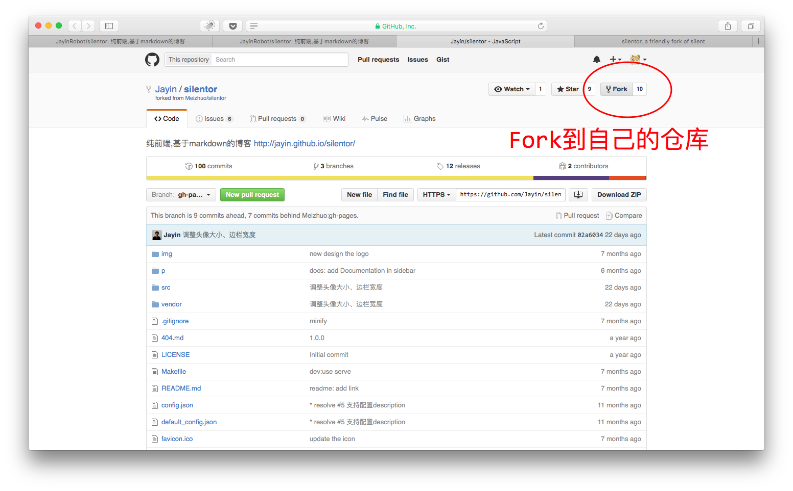
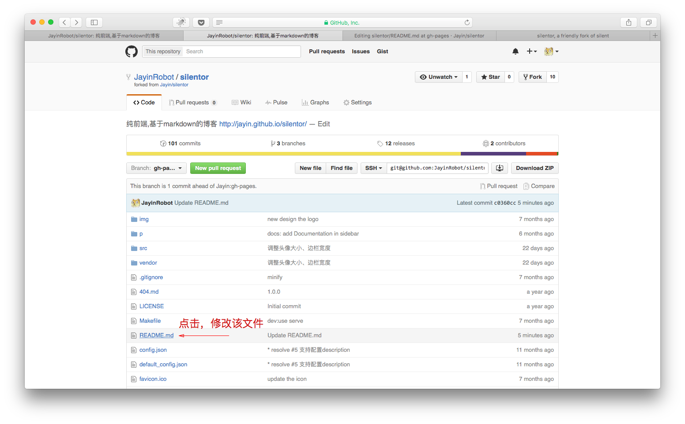
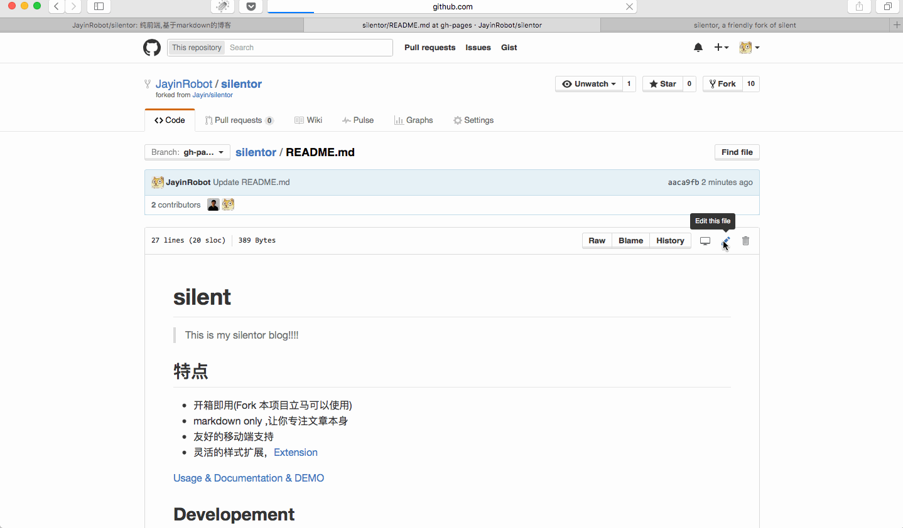
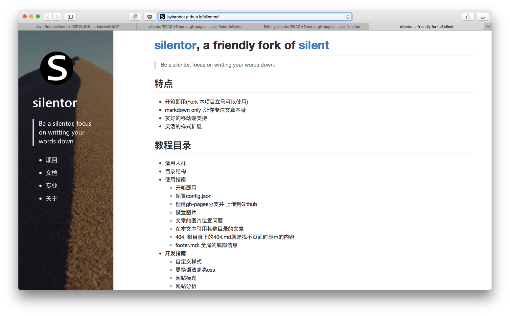

## 1分钟快速构建你的博客

### 第一步：Fork [silentor](https://github.com/Jayin/silentor)到自己的仓库

### 第二步：编辑一次，触发提交

GitHub需要你对仓库又一次push操作，才会把gh-pages分支上的内容托管到他的静态服务器上。为了演示，我们选择修改`README.md`，不修改核心文件(`vendor/`目录)就OK

### 第三步： 在网页上直接编辑修改`README.md`，并提交

### 第四步： 访问`http://{你的github名}.github.io/silentor/` 即可

`{你的github名}`替换成你的github名，例如我的机器人GitHub ID是[JayinRobot](https://github.com/JayinRobot)
则访问：http://jayinrobot.github.io/silentor/ 

